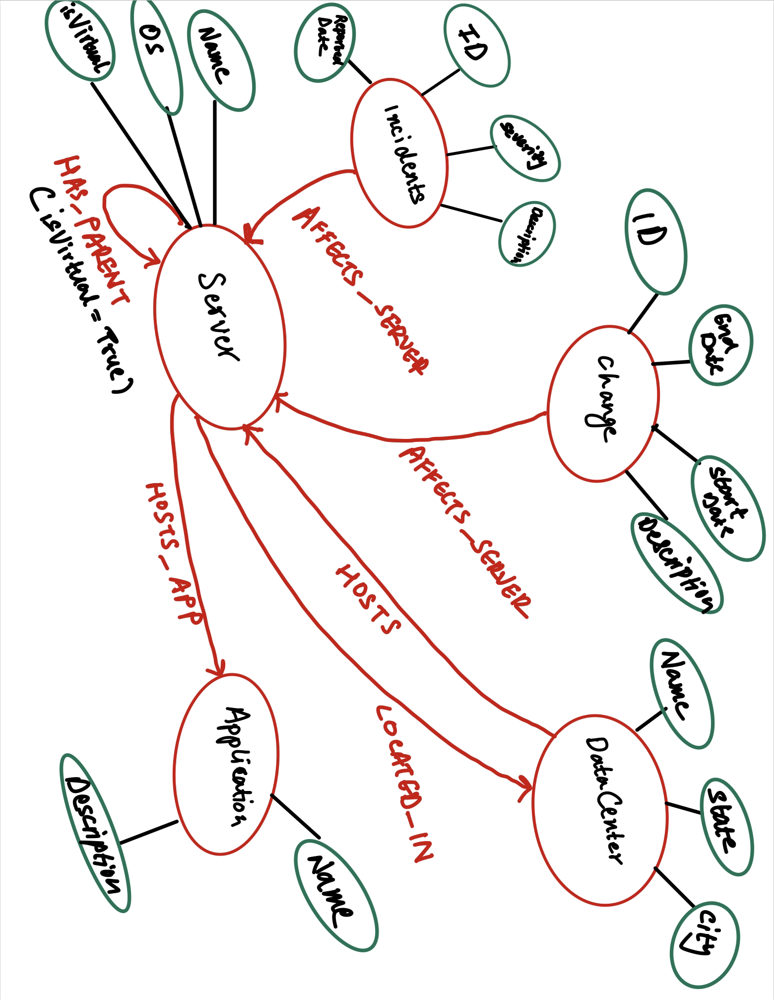

## Transitioning from RDBMS to Graph: Key Concepts

1. **Entity Tables to Node Labels**: 
   - In RDBMS, what is recognized as an entity table translates into a label for nodes within the graph domain.

2. **Rows Become Nodes**: 
   - Every single row from an RDBMS entity table corresponds to a node in the graph model.

3. **Columns Transform to Node Properties**: 
   - Fields or columns present in the relational tables now act as properties for nodes in the graph.

4. **Prioritize Business Primary Keys**: 
   - It's recommended to disregard technical primary keys, while retaining business-centric primary keys.

5. **Incorporate Constraints and Indexes**: 
   - Introduce unique constraints specifically for the primary keys driven by business needs. Furthermore, establish indexes for attributes that are frequently accessed or searched.

6. **Transition from Foreign Keys to Relationships**: 
   - In the graph model, foreign keys connecting tables in RDBMS are represented as relationships. These foreign keys can be removed post-transition.

7. **Avoid Defaults**: 
   - Data entries that have default values should be eliminated as there's typically no requirement to maintain them in the graph model.

8. **Data Sanitization**: 
   - For denormalized tables containing redundant data, consider extracting this data into distinct nodes for a more streamlined graph structure.

9. **Indexed Columns Indicate Array Properties**: 
   - Columns with names indicating indexing (e.g., email1, email2) could potentially represent properties in array format.

10. **Transform Join Tables into Relationships**: 
   - Join tables in the relational realm become relationships in the graph model. Any columns they hold are turned into properties of these relationships.

## Data Model for Neo4j

### Nodes and Their Properties:

#### 1. **Incident**
   - **Properties**: 
     - ID
     - Severity
     - ReportedDate
     - Description
   - **Relationships**: 
     - `AFFECTS_SERVER` (to Server)

#### 2. **Change**
   - **Properties**: 
     - ID
     - StartDate
     - EndDate
     - Description
   - **Relationships**: 
     - `AFFECTS_SERVER` (to Server)

#### 3. **DataCenter**
   - **Properties**: 
     - Name
     - State
     - City
   - **Relationships**: 
     - `HOSTS` (to Server)

#### 4. **Server**
   - **Properties**: 
     - Name
     - OS
     - isVirtual
   - **Relationships**: 
     - `LOCATED_IN` (to DataCenter)
     - `HAS_PARENT` (to Parent Server, only if isVirtual is True)
     - `HOSTS_APP` (to Application)

#### 5. **Application**
   - **Properties**: 
     - Name
     - Description
   - **Relationships**: 
     - `RUNS_ON` (to Server)

### Relationship Descriptions:

- **AFFECTS_SERVER**: Incident/Change to Server. This denotes which server an incident or change affects.
- **LOCATED_IN**: Server to DataCenter. This denotes which data center a server is located in.
- **HAS_PARENT**: Virtual Server to Parent Server. This is for virtual servers to show which physical server they reside on (when isVirtual is True).
- **HOSTS_APP**: Server to Application. This denotes which applications are hosted by a particular server.
- **RUNS_ON**: Application to Server. This denotes which servers an application runs on.

## Neo4j Constraints:

- **Unique Constraints**: 
   - Each **Incident** should have a unique `ID`.
   - Each **Change** should have a unique `ID`.
   - Each **DataCenter** should have a unique `Name`.
   - Each **Server** should have a unique `Name`.
   - Each **Application** should have a unique `Name`.

